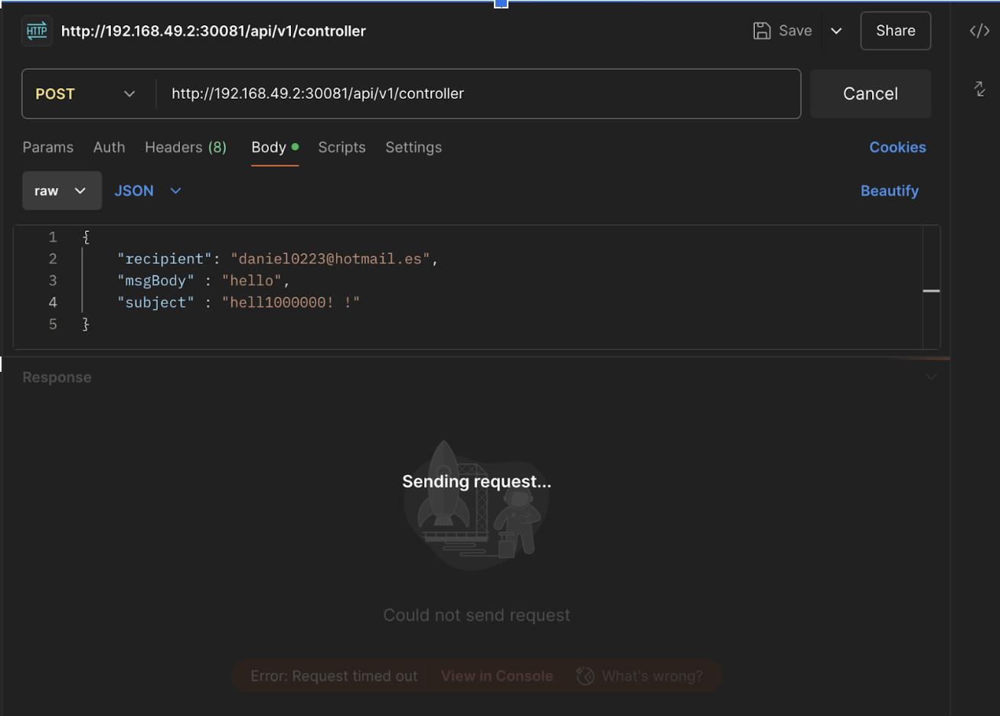
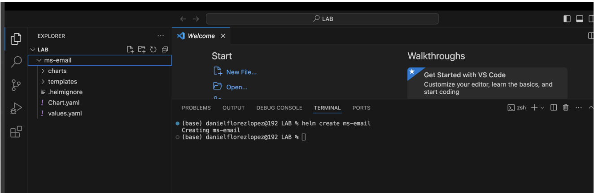
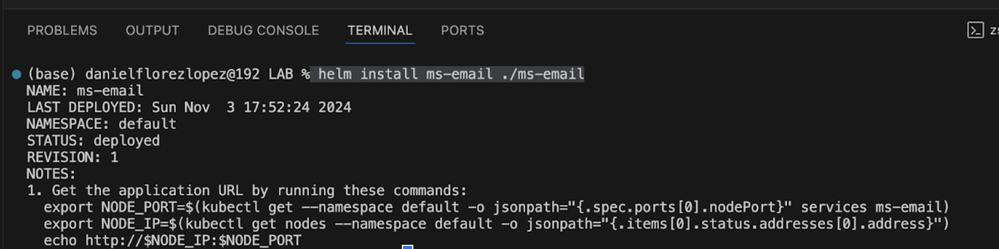
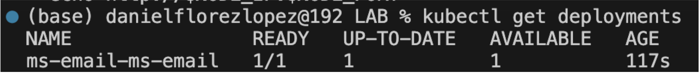

# Laboratorio 

## Objetivo del laboratorio:
Al finalizar la práctica, serás capaz de:
- Crear un chart personalizable con Helm.
- Desplegar servicios con Helm.

## Objetivo visual: 
Crear un chart personalizable que tenga como objetivo desplegar el microservicio de correos electrónicos por medio de Helm.


## Duración aproximada:
- 30 minutos.
  
## Instrucciones 

### Tarea 1. Creación de un chart
Paso 1. Crear una nueva carpeta vacia con el nombre LAB.

Paso 2. Abrir la carpeta LAB en Visual Code.

Paso 3. Ejecutar el comando 'helm create ms-email' y se generará el chart automáticamente.

### shell
```shell
helm create ms-email
```



### Tarea 2. Modificar el manifiesto values.yaml

Paso 1. Abrir el archivo `values.yaml`.

Paso 2. Crear una sola replica del servicio `replicaCount = 1`.

Paso 3. La imagen a utilizar va a ser. 
### YAML
```
replicaCount: 1

image:
 repository: daniel0223/netec_email
 tag: latest
 pullPolicy: IfNotPresent


service:
 type: NodePort
 port: 8081


containerPort: 8081
```

### Tarea 3. Modificar el manifiesto deployment.yaml

Paso 1. Abrir el archivo templates/deployment.yaml y ajustarlo.

Paso 2. La imagen a utilizar va a ser.
### YAML
```
apiVersion: apps/v1
kind: Deployment
metadata:
 name: {{ .Release.Name }}-ms-email
spec:
 replicas: {{ .Values.replicaCount }}
 selector:
   matchLabels:
     app: {{ .Release.Name }}-ms-email
 template:
   metadata:
     labels:
       app: {{ .Release.Name }}-ms-email
   spec:
     containers:
       - name: ms-email
         image: "{{ .Values.image.repository }}:{{ .Values.image.tag }}"
         ports:
           - containerPort: {{ .Values.containerPort }}
```

### Tarea 4. Modificar el manifiesto service.yaml

Paso 1. Abrir el archivo `templates/service.yaml`.

Paso 2. Configuramos el service para definir los componentes del clúster que tienen acceso en el kubernetes.
### YAML
```
# templates/service.yaml


apiVersion: v1
kind: Service
metadata:
 name: {{ .Release.Name }}-ms-email
spec:
 type: {{ .Values.service.type }}
 ports:
   - port: {{ .Values.service.port }}
     targetPort: {{ .Values.containerPort }}
     nodePort: 30081  # Puedes especificar el NodePort o dejar que Kubernetes lo asigne
 selector:
   app: {{ .Release.Name }}-ms-email
```
### Tarea 5. Desplegar el chart

Paso 1. Ubicarnos en la ruta donde creamos el chart y desplegar el servicio configurado.

### shell
```shell
 helm install ms-email ./ms-email
```



Paso 1. Validar despliegue.

### shell
```shell
 kubectl get deployments
```



### Resultado esperado

