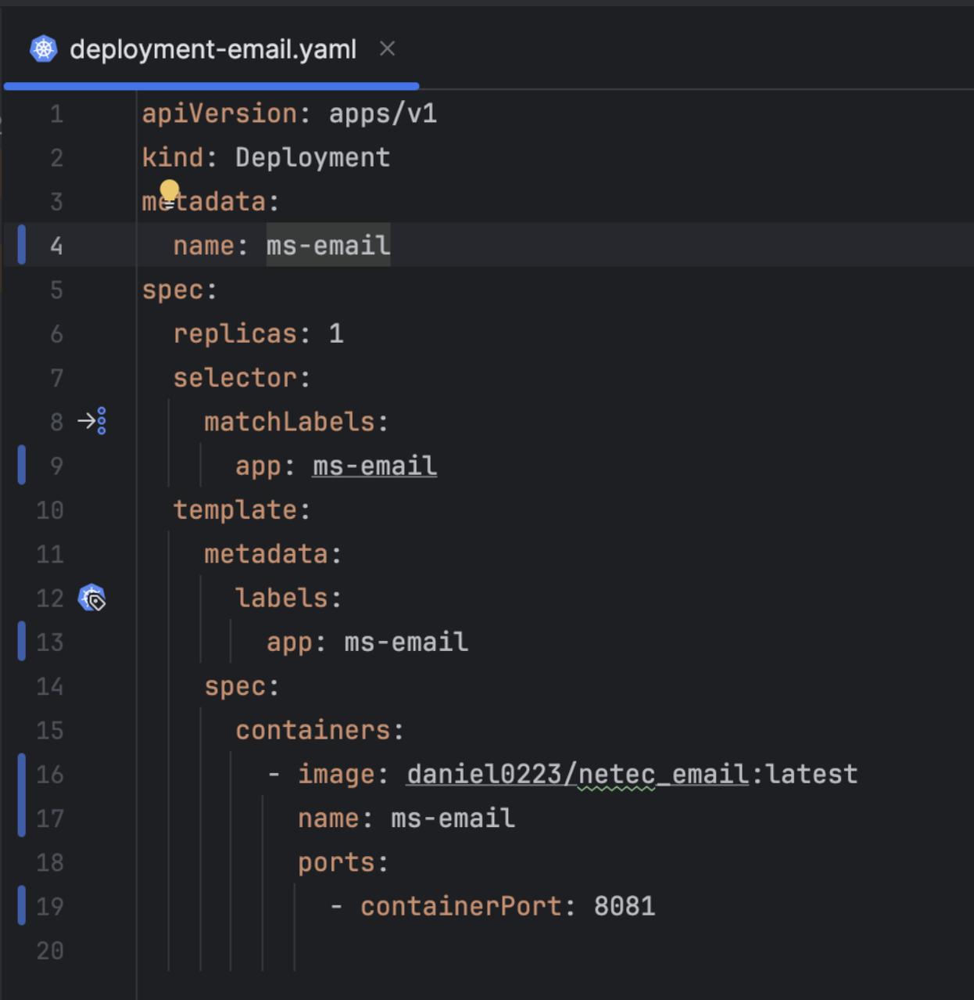
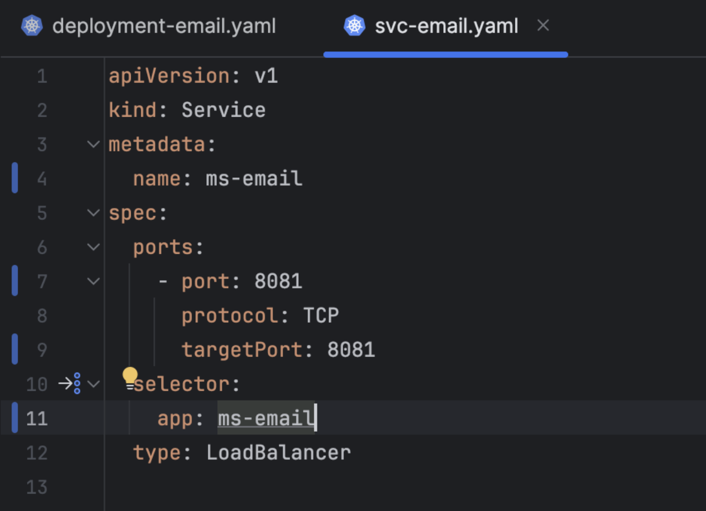
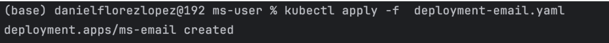
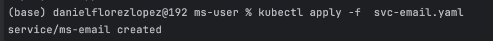
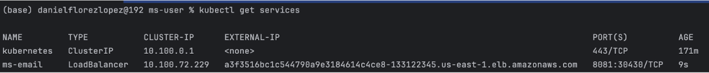

# Práctica 2. Despliegue de Kubernetes

## Objetivo del laboratorio:
Al finalizar la práctica, serás capaz de:

- Desplegar un servicio de correos electrónicos en un clúster de Kubernetes utilizando Minikube.
- Crear y configurar manifiestos YAML necesarios para desplegar recursos en Kubernetes.
- Configurar un proyecto de backend para integrarlo con el entorno de Kubernetes.

## Objetivo visual

El objetivo es lograr un despliegue exitoso del servicio de correos electrónicos en Kubernetes, validando que el pod y el servicio estén operativos.


## Duración aproximada:
- 45 minutos.
  
## Instrucciones

### Tarea 1. Configurando manifiesto

Paso 1. Crear el archivo `deployment-email.yaml`.
Este manifiesto se utiliza para describir el despliegue del servicio, incluyendo la cantidad de réplicas y la imagen del contenedor que se utilizará. Asegúrate de que el manifiesto incluya configuraciones como el selector de etiquetas y la especificación del contenedor.




Paso 2. Crear un manifiesto para exponer el servicio. Este manifiesto define el servicio que expone el pod hacia el exterior del clúster o dentro del clúster, dependiendo del tipo de servicio configurado (por ejemplo, ClusterIP, NodePort o LoadBalancer).



### Tarea 2. Desplegar servicio

Crear y desplegar los recursos definidos en los manifiestos YAML dentro del clúster de Minikube.

Paso 1. Ejecutar el siguiente comando para aplicar el manifiesto y crear el pod en Kubernetes.



### shell
```shell
 kubectl apply -f deployment-email.yaml
```

Paso 2. Ejecutar el siguiente comando para aplicar el manifiesto y exponer el pod a través de un servicio en Kubernetes:



### shell
```shell
 kubectl apply -f svc-email.yaml
```

Paso 3. Ejecutar el siguiente comando para verificar que el pod se esté ejecutando correctamente:




### shell
```shell
 kubectl get pods
```


### Resultado esperado


Al finalizar el laboratorio, tendrás un servicio funcional de correos electrónicos desplegado en Minikube, como se muestra en la siguiente imagen:


