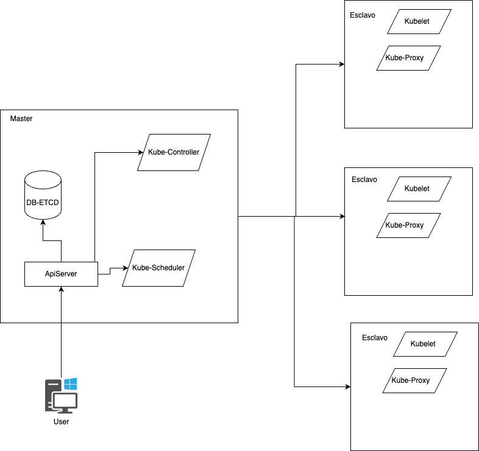
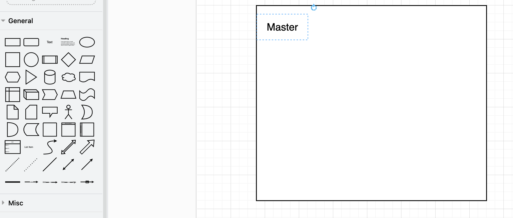
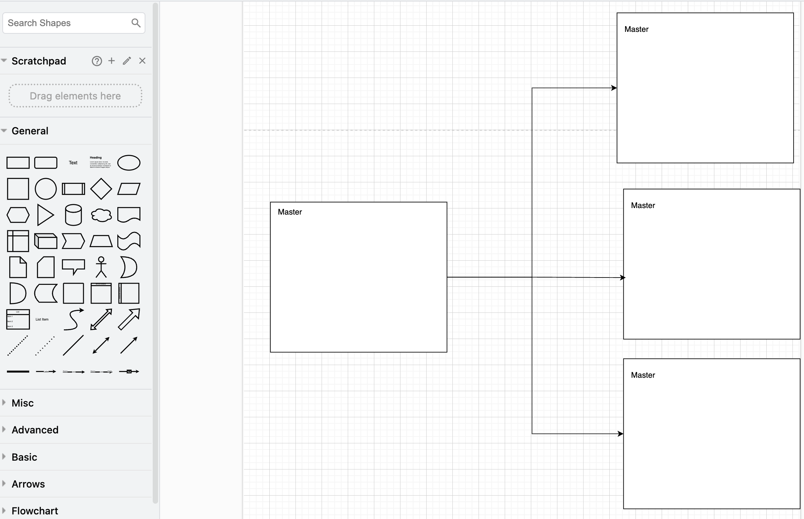
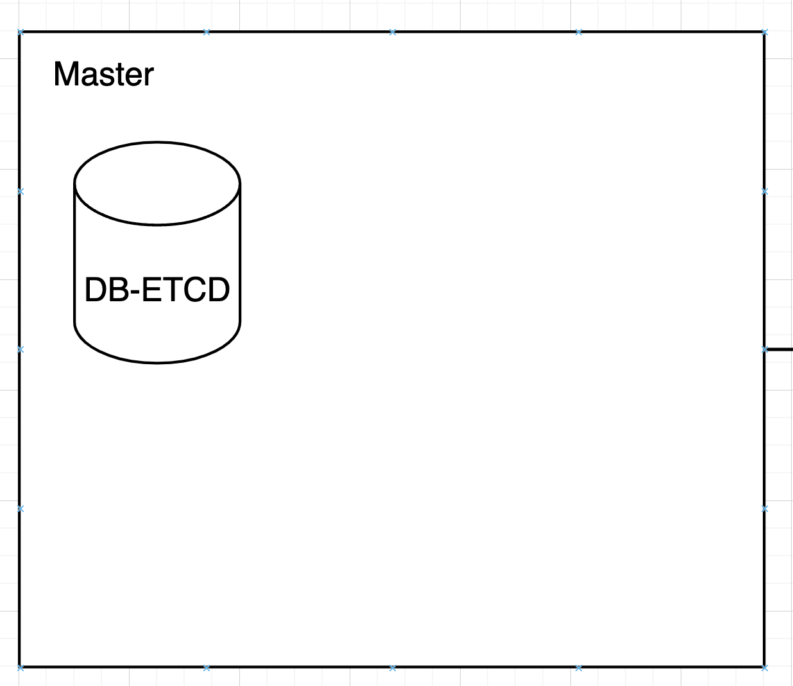
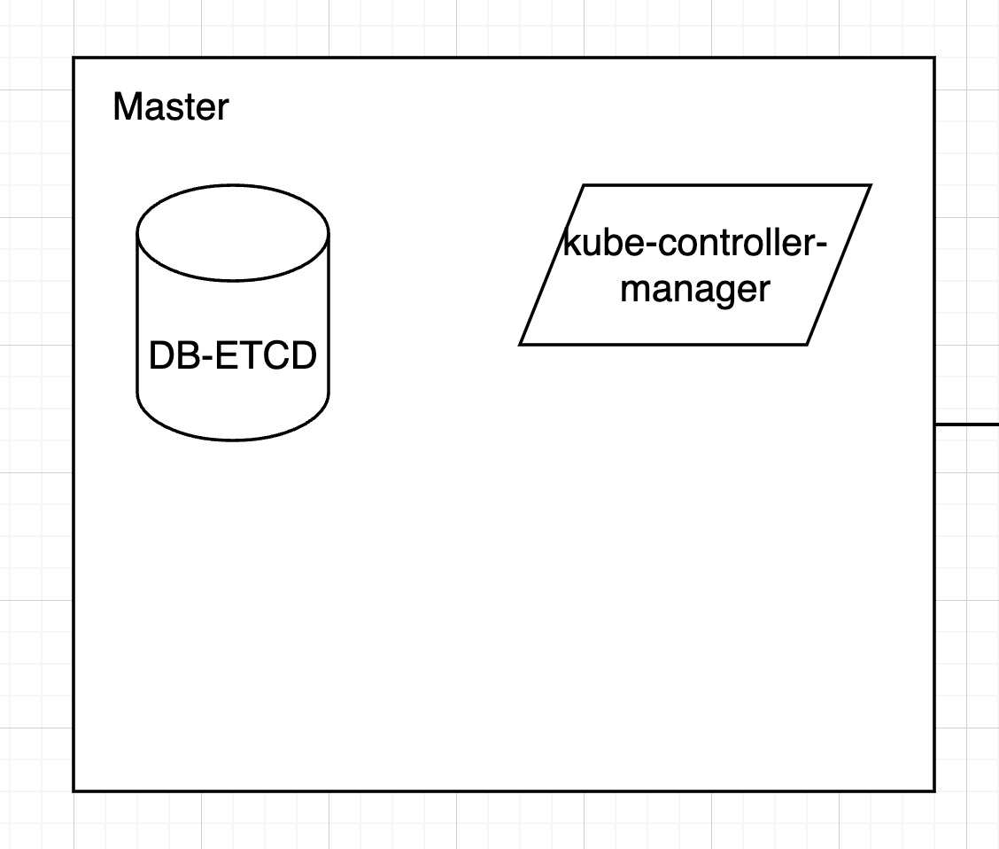
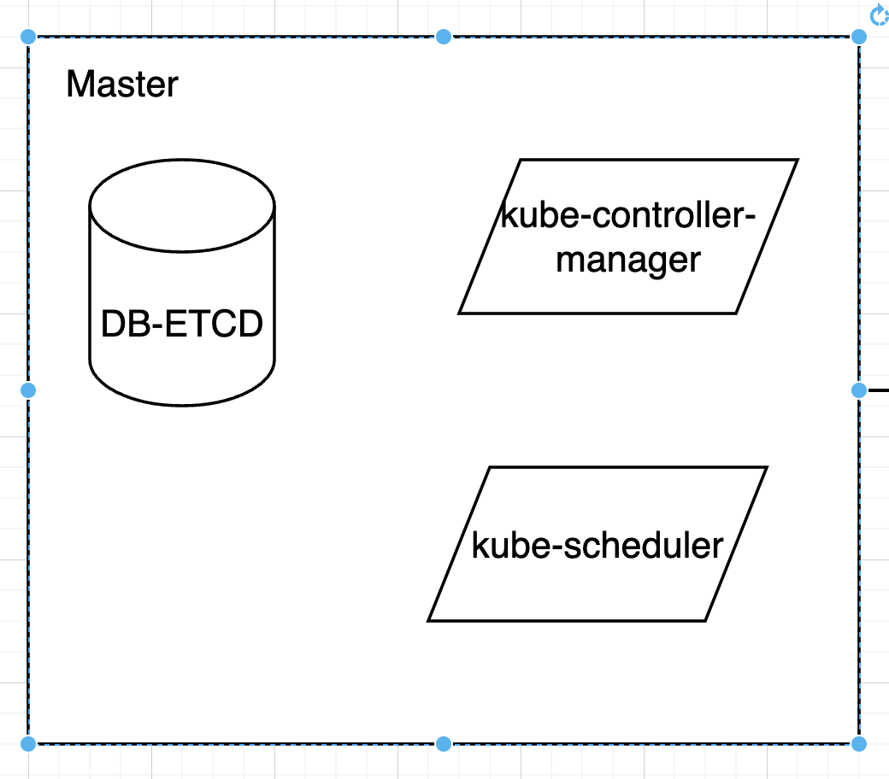
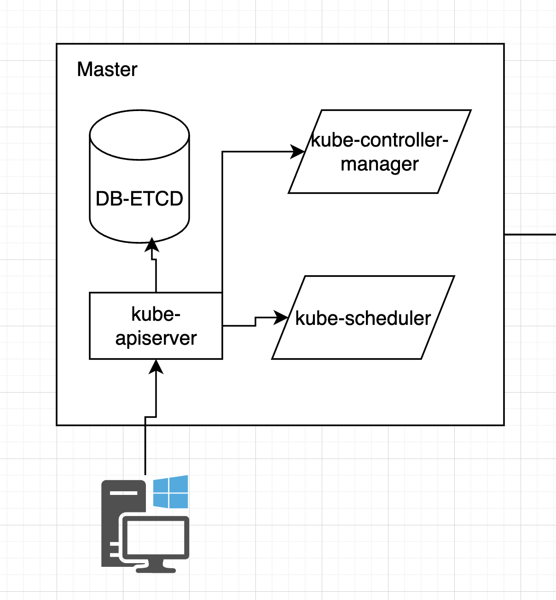
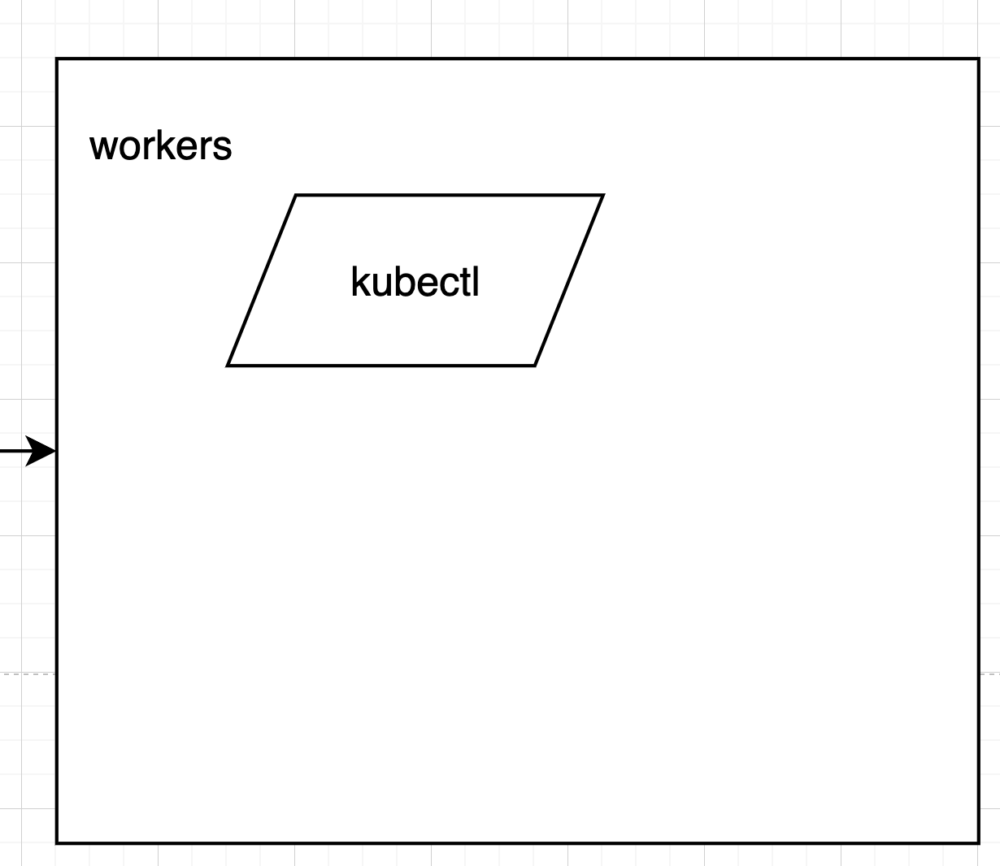
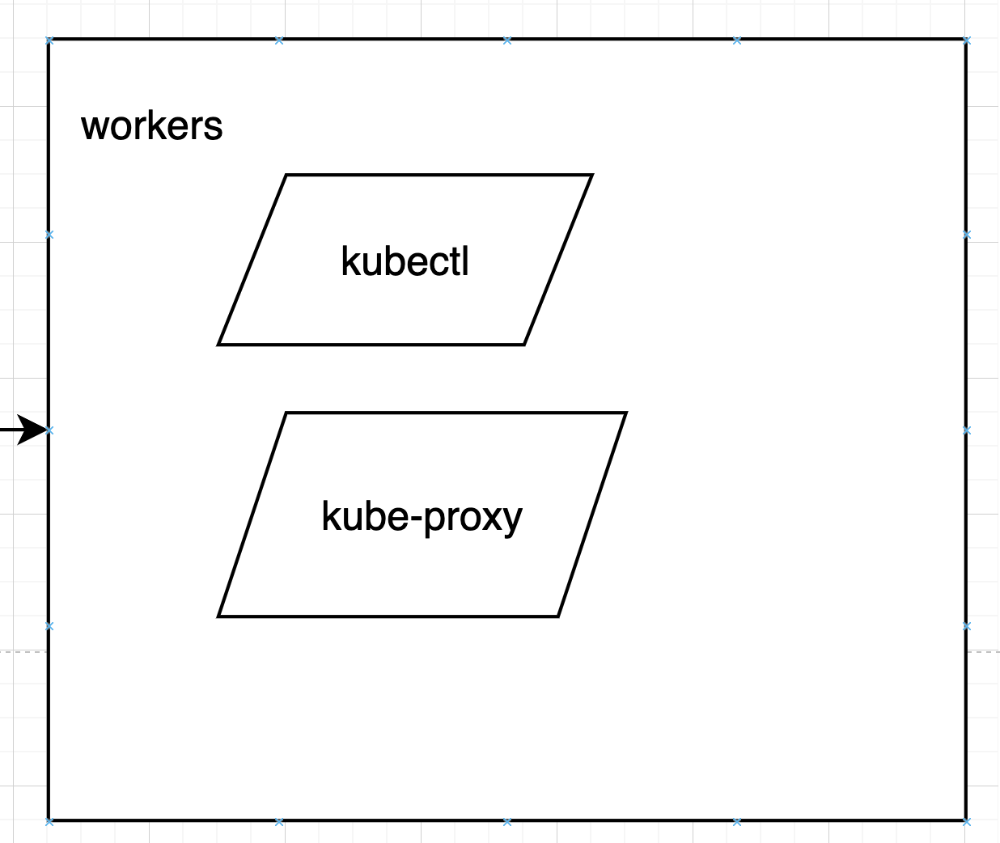

# Diagrama arquitectura K8s alta disponibilidad

## Objetivo de la práctica:
Al finalizar la práctica, serás capaz de:
- Comprender como se integran los componentes internos de Kubernetes.
- Entender como arquitectar un sistema de alta disponibilidad en Kubernetes.

## Objetivo visual 
Crear un diagrama de arquitectura de Kubernetes con una alta disponibilidad junto con sus componentes.

## Duración aproximada:
- 20 minutos.

## Instrucciones 
Para realizar el diagrama de arquitectura de alta disonibilidad se sugiere usar la herramienta online draw.io https://app.diagrams.net/ ya que esta cuenta con una gran variedad de componentes que se van a ajustar a nuestras necesidades.

### Tarea 1. Creacion Cluster de alta disponibilidad

Nota : En Kubernetes, se recomienda usar un número impar de nodos maestros para asegurar consenso en el control plane (evitar empates en etcd) y un número par de nodos trabajadores para balancear la carga de las aplicaciones.

Paso 1. Crear el nodo master, el cual tiene la responsabilidad de adminsitrar el clúster y ejecutar los componentes de autogestion de k8s.

Paso 2. Crear 3 workers, los cuales tendran la tarea de ejecutar los contenedores y llevar acabo las tareas asignadas por el master. Recuerda que la relación entre master y worker debe ser impar.

### Tarea 2. Añadir componentes internos que utiliza k8s en los master
Paso 1. Agregar en el master el componente **DB-ETCD**, el cual tiene la responsabilidad de almacenar y replicar el estado del clúster, incluyendo la configuración, metadatos y datos clave-valor, garantizando consistencia y alta disponibilidad.

Paso 2.
Agregar en el master el componente **kube-controller-manager**, el cual tiene la responsabilidad de gestionar los controladores que regulan el estado deseado del clúster, como la replicación de pods, la gestión de nodos y la reconciliación de recursos.

Paso 3. Crear en el master el componente **kube-scheduler**, el cual tiene la responsabilidad de asignar los pods recién creados a los nodos disponibles, evaluando recursos, afinidad, tolerancias y restricciones.

Paso 4. Crear en el master el componente **kube-apiserver**, el cual tiene la responsabilidad de actuar como punto central de comunicación en Kubernetes, gestionando las peticiones de los usuarios y otros componentes. Interactúa con DB-ETCD para leer y almacenar el estado del clúster, con kube-controller-manager para ejecutar controladores y con kube-scheduler para coordinar la asignación de pods a los nodos.

### Tarea 3. componentes en el worker

Paso 1. Crear en el worker el componente **kubectl**, el cual tiene la responsabilidad de actuar como la interfaz de línea de comandos para interactuar con el clúster, permitiendo gestionar recursos, verificar el estado y enviar comandos al API server desde cualquier máquina autorizada.

Paso 2. Crear en el worker el componente **kube-proxy**, el cual tiene la responsabilidad de gestionar las reglas de red y la comunicación dentro del clúster, asegurando el acceso a los servicios y el balanceo de carga entre los pods.

### Resultado esperado

