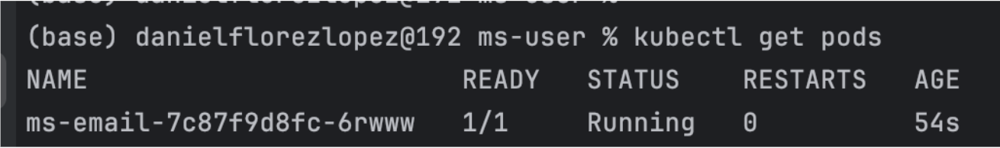
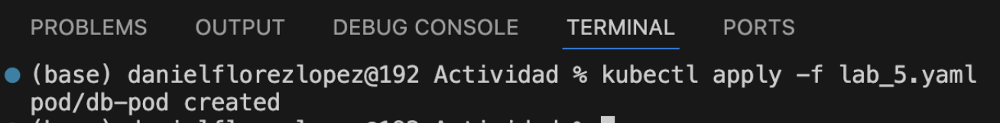
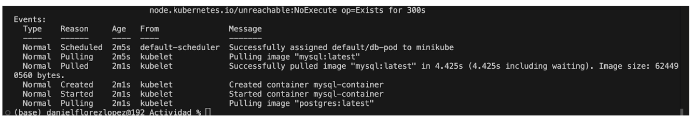
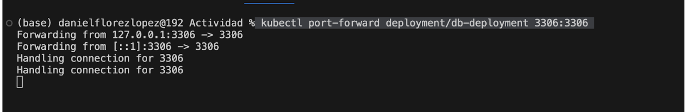
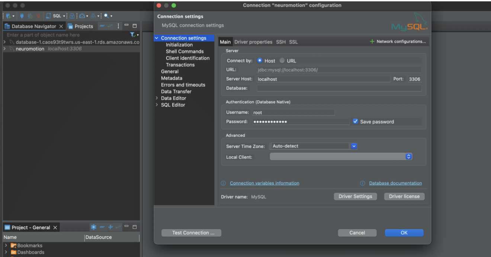

# Práctica 5. Múltiples contenedores

## Objetivo del laboratorio:
Al finalizar la práctica, serás capaz de:
- Crear un manifiesto en Kubernetes para desplegar múltiples servicios dentro de un mismo pod.
- Configurar y desplegar dos bases de datos (MySQL y PostgreSQL) en un único manifiesto YAML.

## Objetivo visual

Desplegar un pod en Kubernetes que aloje dos bases de datos configuradas y funcionales.




## Duración aproximada:
- 45 minutos.
  
## Instrucciones
### Tarea 1. Creando manifiesto

Paso 1. Crear el `lab5.yaml`. Definir un manifiesto YAML que describa un pod con dos contenedores: uno para MySQL y otro para PostgreSQL. Configurar las variables de entorno necesarias para ambas bases de datos y especificar los puertos expuestos.

### YAML
```YAML
apiVersion: v1
kind: Pod
metadata:
  name: db-pod
  labels:
    app: db-app
spec:
  containers:
    - name: mysql-container
      image: mysql:latest
      env:
        - name: MYSQL_ROOT_PASSWORD
          value: "rootpassword"
      ports:
        - containerPort: 3306


    - name: postgres-container
      image: postgres:latest
      env:
        - name: POSTGRES_DB
          value: "mydatabase"
        - name: POSTGRES_USER
          value: "myuser"
        - name: POSTGRES_PASSWORD
          value: "mypassword"
      ports:
        - containerPort: 5432
```

### Tarea 2. Desplegar múltiples contenedores

Paso 1. Ejecutar el comando para crear los múltiples contenedores. Utilizar el siguiente comando para aplicar el manifiesto y crear el pod que contiene los dos contenedores:

### shell
```shell
 kubectl apply -f deployment-email.yaml
```



Paso 2. Usar el comando `kubectl describe` para inspeccionar los detalles del pod y verificar que los contenedores se hayan creado correctamente:




### shell
```shell
 kubectl describe pod db-pod
```

### NOTA IMPORTANTE

1 . Si se tarda en crear el contenedor, primero descargar la imagen con el siguiente comando:
### shell
```shell
 docker pull postgres:latest
```

2. Para obtener la IP de los Pods desplegados, utilizar el siguiente comando:

### shell
```shell
  kubectl port-forward deployment/db-deployment 3306:3306t
```

### Resultado esperado


